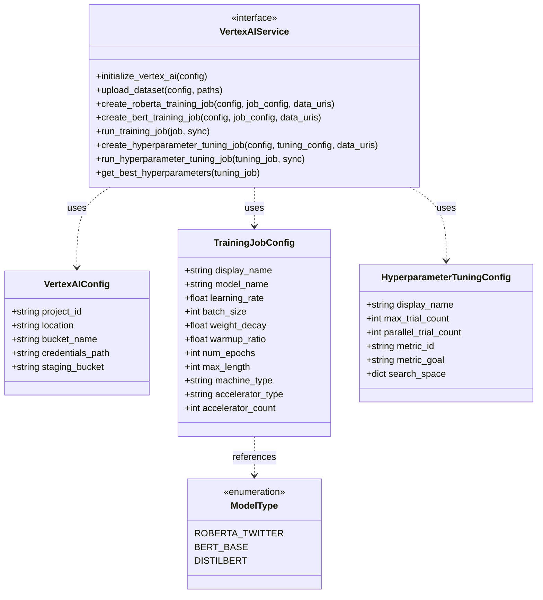
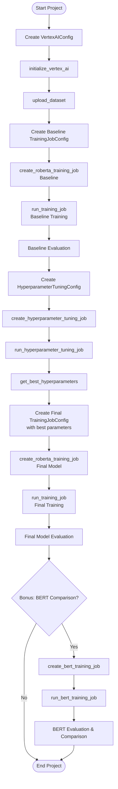

# Vertex AI API Documentation

## Overview

This document explains the API (Application Programming Interface) layer for the Vertex AI sentiment analysis project. Think of an API as a control panel with clearly labeled buttons and dials that make complex operations simple.

### What is an API Contract Layer?

The API contract layer is a **stable, type-safe interface** that defines HOW to interact with our system WITHOUT implementing the actual functionality. Think of it like a restaurant menu - it tells you what's available and what to expect, but it doesn't cook the food.

**Key principle**: This layer contains ONLY dataclasses, type definitions, and function signatures. The actual implementation lives in vertex_ai.example.ipynb and vertex_ai_utils.py.

### Why Separate Contract from Implementation?

1. **Stability**: The contract rarely changes, even when implementation details evolve
2. **Type Safety**: Dataclasses catch configuration errors before runtime
3. **Clear Interface**: Anyone can understand what the system needs without reading implementation code
4. **Easy Integration**: Other developers can write their own implementations that satisfy this contract
5. **Maintainability**: Changes to how things work internally don't break the external interface

### API Structure Diagram

The following diagram shows how the contract layer organizes our configuration objects and function signatures:



### API Workflow

The following flowchart shows the typical sequence of API calls for a complete sentiment analysis project:



---

## Configuration Blocks

### VertexAIConfig

This stores information about your Google Cloud setup.

What it contains:

project_id: Your Google Cloud project name (like a unique ID for your workspace)

location: Which region to use (for example, "us-central1" means Central United States)

bucket_name: Name of your storage bucket (a container where files are kept in the cloud)

credentials_path: Location of your login key file (default is "vertex-ai-key.json")

staging_bucket: Optional location for temporary files (automatically created if you don't specify one)

The staging bucket is automatically set to gs://{bucket_name}/staging if you don't provide a specific location.

Example of how to use it:
```
config = VertexAIConfig(
    project_id="noted-cortex-477800-b7",
    location="us-central1",
    bucket_name="my-vertex-ai-bucket"
)
```

### TrainingJobConfig

This stores all the settings for training a model.

What it contains:

display_name: A human-readable name for your training job

model_name: Which pre-trained model to use (default is "cardiffnlp/twitter-roberta-base-sentiment-latest", a model trained on Twitter data)

learning_rate: How fast the model learns (default is 0.00002, which is slow and careful)

batch_size: How many tweets to process at once (default is 32)

weight_decay: Prevents overfitting by adding a small penalty (default is 0.01)

warmup_ratio: How gradually to start training (default is 0.1, meaning 10 percent warmup)

num_epochs: How many times to go through all the data (default is 4)

max_length: Maximum number of words to consider (default is 128, good for tweets)

machine_type: What kind of computer to use (default is "n1-standard-4", which has 4 processors and 15 GB memory)

accelerator_type: What kind of graphics processor to use (default is "NVIDIA_TESLA_T4", a GPU that speeds up training)

accelerator_count: How many graphics processors to use (default is 1)

Example of how to use it:
```
job_config = TrainingJobConfig(
    display_name="roberta-sentiment-training",
    learning_rate=2e-5,
    batch_size=32,
    num_epochs=4
)
```

### HyperparameterTuningConfig

This stores settings for optimizing the training settings automatically.

What it contains:

display_name: A human-readable name for the optimization job

max_trial_count: Maximum number of different combinations to try (default is 10)

parallel_trial_count: How many to test at the same time (default is 2 to save time)

metric_id: Which measure to optimize (default is "f1_macro", a balanced accuracy measure)

metric_goal: Whether to maximize or minimize the metric (default is "maximize" for accuracy)

search_space: Which settings to test and in what ranges (automatically generated if you don't provide it)

Default search ranges:

learning_rate: Test values between 0.000005 and 0.00005 on a logarithmic scale

batch_size: Test either 16 or 32

weight_decay: Test values between 0.001 and 0.1 on a linear scale

warmup_ratio: Test values between 0.0 and 0.3 on a linear scale

Example of how to use it:
```
tuning_config = HyperparameterTuningConfig(
    display_name="roberta-hp-tuning",
    max_trial_count=10,
    parallel_trial_count=2
)
```

### ModelType

This is a list of available pre-trained models you can choose from.

Options:

ROBERTA_TWITTER: Twitter-optimized RoBERTa model trained on 124 million tweets, best for social media text

BERT_BASE: Standard BERT model trained on Wikipedia and books, good for formal text

DISTILBERT: Smaller, faster version of BERT that trades some accuracy for speed

---

## Initialization Functions

### initialize_vertex_ai()

This function connects to Google Cloud and sets everything up.

What it needs:

config: A VertexAIConfig with your project information

What it returns:

Nothing (it just sets things up)

This function must be called before you do anything else with Vertex AI. It logs you in using your credentials and tells Google Cloud which project and region to use.

Example:
```
config = VertexAIConfig(
    project_id="noted-cortex-477800-b7",
    location="us-central1",
    bucket_name="my-vertex-ai-bucket"
)
initialize_vertex_ai(config)
```

What you will see:
[SUCCESS] Vertex AI initialized for project: noted-cortex-477800-b7

---

## Data Upload Functions

### upload_dataset()

This function uploads your training, validation, and test data files to Google Cloud Storage.

What it needs:

config: A VertexAIConfig with your storage bucket information

train_path: Location of your training data file on your computer (must be JSONL format)

val_path: Location of your validation data file on your computer (must be JSONL format)

test_path: Location of your test data file on your computer (must be JSONL format)

destination_folder: What to call the folder in cloud storage (default is "sentiment-data")

What it returns:

Three cloud addresses (URIs) where your files are now stored: train_uri, val_uri, and test_uri

This function takes all three data files from your local computer and copies them to Google Cloud Storage so Vertex AI can access them during training.

Example:
```
train_uri, val_uri, test_uri = upload_dataset(
    config=config,
    train_path="Data/train.jsonl",
    val_path="Data/val.jsonl",
    test_path="Data/test.jsonl"
)
```

What you will see:
[UPLOAD] Uploading datasets to gs://my-bucket/sentiment-data/
[SUCCESS] All datasets uploaded!

---

## Training Job Functions

### create_roberta_training_job()

This function sets up a training job for the Twitter-RoBERTa model.

What it needs:

config: A VertexAIConfig with your project information

job_config: A TrainingJobConfig with your training settings

train_data_uri: Cloud address of your training data

val_data_uri: Cloud address of your validation data

test_data_uri: Cloud address of your test data

training_script_path: Location of the training script (default is "vertex_ai_training.py")

metric_name: What metric to track (default is "f1_macro")

What it returns:

A training job object (not yet started, just configured)

This function prepares everything for training but doesn't actually start it yet. Think of it like programming a coffee maker - you set all the settings, but the coffee won't brew until you press start.

Example:
```
job_config = TrainingJobConfig(
    display_name="roberta-sentiment-v1",
    learning_rate=2e-5,
    batch_size=32
)

job = create_roberta_training_job(
    config=config,
    job_config=job_config,
    train_data_uri=train_uri,
    val_data_uri=val_uri,
    test_data_uri=test_uri
)
```

What you will see:
[INFO] Creating RoBERTa training job: roberta-sentiment-v1
[SUCCESS] Training job created: roberta-sentiment-v1

### run_training_job()

This function actually starts the training job.

What it needs:

job: A training job object from create_roberta_training_job() or create_bert_training_job()

sync: Whether to wait for the job to finish (default is True, which means wait)

What it returns:

The same training job object, but now it's completed (if sync was True)

If sync is True, this function will wait (blocking) until training finishes, which takes 15-20 minutes. If sync is False, it starts the job and immediately returns so you can do other things while training runs in the background.

Example:
```
job = run_training_job(job, sync=True)
```

What you will see:
[START]  Starting training job...
[WAIT] Running synchronously (will wait for completion)...
Monitor: https://console.cloud.google.com/vertex-ai/training/custom-jobs
[SUCCESS] Training job completed!

---

## BERT Baseline Functions (Bonus Feature)

### create_bert_training_job()

This function sets up a training job for the BERT model as a baseline for comparison.

What it needs:

Same as create_roberta_training_job()

What it returns:

A BERT training job object (not yet started)

This function is identical to create_roberta_training_job() but uses the BERT model instead of RoBERTa. We use it to create a baseline so we can prove that Twitter-RoBERTa performs better for tweet analysis.

Example:
```
bert_config = TrainingJobConfig(
    display_name="bert-baseline-v1",
    model_name="bert-base-uncased",
    learning_rate=2e-5
)

bert_job = create_bert_training_job(
    config=config,
    job_config=bert_config,
    train_data_uri=train_uri,
    val_data_uri=val_uri,
    test_data_uri=test_uri
)
```

What you will see:
[INFO] Creating BERT baseline job: bert-baseline-v1
[INFO] BONUS: For transfer learning comparison
[SUCCESS] BERT training job created: bert-baseline-v1

### run_bert_training_job()

This function starts the BERT training job.

What it needs:

job: A BERT training job object

sync: Whether to wait for completion (default is True)

What it returns:

The completed BERT training job object (if sync was True)

This is the same as run_training_job() but provides BERT-specific status messages.

Example:
```
bert_job = run_bert_training_job(bert_job, sync=True)
```

What you will see:
[START]  Starting BERT training job...
[SUCCESS] BERT training job completed!

---

## Hyperparameter Optimization Functions

### create_hyperparameter_tuning_job()

This function sets up a job to automatically find the best training settings.

What it needs:

config: A VertexAIConfig with your project information

tuning_config: A HyperparameterTuningConfig with optimization settings

train_data_uri: Cloud address of your training data

val_data_uri: Cloud address of your validation data

test_data_uri: Cloud address of your test data

training_script_path: Location of the training script (default is "vertex_ai_training.py")

What it returns:

A hyperparameter tuning job object (not yet started)

This function creates a job that will test different combinations of settings to find which ones give the best results. For example, it might try learning rate 0.00001 with batch size 16, then learning rate 0.00003 with batch size 32, and so on.

Example:
```
tuning_config = HyperparameterTuningConfig(
    display_name="roberta-hp-tuning",
    max_trial_count=10,
    parallel_trial_count=2
)

tuning_job = create_hyperparameter_tuning_job(
    config=config,
    tuning_config=tuning_config,
    train_data_uri=train_uri,
    val_data_uri=val_uri,
    test_data_uri=test_uri
)
```

What you will see:
[INFO] Creating hyperparameter tuning job: roberta-hp-tuning
   Max trials: 10
   Parallel trials: 2
[SUCCESS] Hyperparameter tuning job created: roberta-hp-tuning

### run_hyperparameter_tuning_job()

This function starts the hyperparameter tuning job.

What it needs:

tuning_job: A hyperparameter tuning job object

sync: Whether to wait for completion (default is False because it takes hours)

What it returns:

The tuning job object

Since hyperparameter tuning takes 2-3 hours, we recommend using sync=False so you don't have to wait. The job will run in the background and you can check the results later.

Example:
```
tuning_job = run_hyperparameter_tuning_job(tuning_job, sync=False)
```

What you will see:
[START]  Starting hyperparameter tuning...
[ASYNC] Running asynchronously (recommended)
[SUCCESS] Hyperparameter tuning job submitted!
Monitor: https://console.cloud.google.com/vertex-ai/training/hyperparameter-tuning-jobs

### get_best_hyperparameters()

This function retrieves the best settings found during optimization.

What it needs:

tuning_job: A completed hyperparameter tuning job

What it returns:

A dictionary (collection) containing the best settings and their performance, or None if no results are available

The result looks like this:
```
{
    "trial_id": "1",
    "parameters": {
        "learning_rate": 0.0000158,
        "batch_size": 32,
        "weight_decay": 0.0505,
        "warmup_ratio": 0.15
    },
    "metrics": {
        "f1_macro": 0.8076
    }
}
```

Example:
```
tuning_job.wait()
best_params = get_best_hyperparameters(tuning_job)
```

What you will see:
[RESULT] Best Trial: 1

   Parameters:
      learning_rate: 0.0000158
      batch_size: 32
      weight_decay: 0.0505
      warmup_ratio: 0.15

   Metrics:
      f1_macro: 0.8076

---

## Complete Example Workflow

Here is how to use all the functions together for a complete sentiment analysis project:

```
from dataclasses import dataclass
from typing import Dict, List, Optional, Tuple, Any
import vertex_ai_utils as vai
from google.cloud import aiplatform

# Step 1: Set up your Google Cloud configuration
config = VertexAIConfig(
    project_id="noted-cortex-477800-b7",
    location="us-central1",
    bucket_name="my-vertex-ai-bucket"
)

# Step 2: Connect to Vertex AI
initialize_vertex_ai(config)

# Step 3: Upload your prepared data files to cloud storage
train_uri, val_uri, test_uri = upload_dataset(
    config=config,
    train_path="Data/train.jsonl",
    val_path="Data/val.jsonl",
    test_path="Data/test.jsonl"
)

# Step 4: Create and run a RoBERTa training job
job_config = TrainingJobConfig(
    display_name="roberta-sentiment-v1",
    learning_rate=2e-5,
    batch_size=32,
    num_epochs=4
)

roberta_job = create_roberta_training_job(
    config=config,
    job_config=job_config,
    train_data_uri=train_uri,
    val_data_uri=val_uri,
    test_data_uri=test_uri
)

roberta_job = run_training_job(roberta_job, sync=True)

# Step 5: Create and run hyperparameter tuning to find better settings
tuning_config = HyperparameterTuningConfig(
    display_name="roberta-hp-tuning",
    max_trial_count=10,
    parallel_trial_count=2
)

tuning_job = create_hyperparameter_tuning_job(
    config=config,
    tuning_config=tuning_config,
    train_data_uri=train_uri,
    val_data_uri=val_uri,
    test_data_uri=test_uri
)

tuning_job = run_hyperparameter_tuning_job(tuning_job, sync=False)

# Step 6: Later, after tuning completes, get the best settings
tuning_job.wait()
best_params = get_best_hyperparameters(tuning_job)

# Step 7: As a bonus, create BERT baseline for comparison
bert_config = TrainingJobConfig(
    display_name="bert-baseline-v1",
    model_name="bert-base-uncased"
)

bert_job = create_bert_training_job(
    config=config,
    job_config=bert_config,
    train_data_uri=train_uri,
    val_data_uri=val_uri,
    test_data_uri=test_uri
)

bert_job = run_bert_training_job(bert_job, sync=True)
```

---

